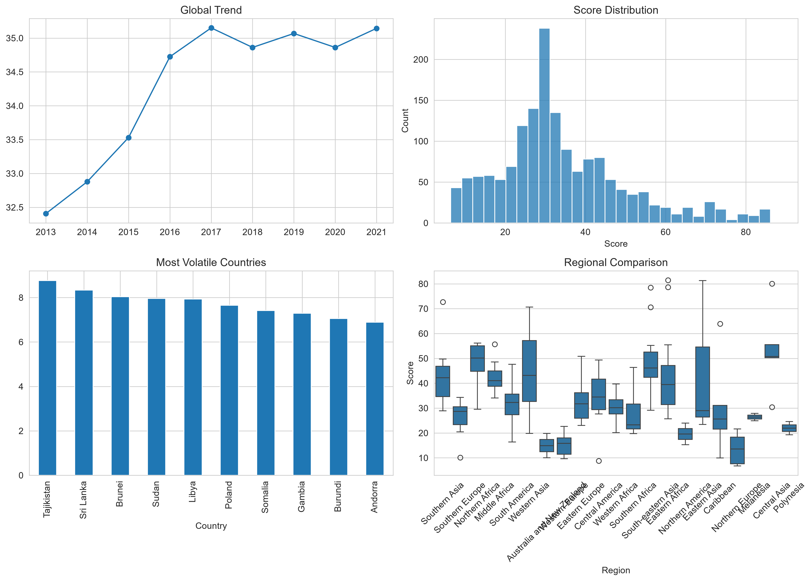

# Press Freedom Analysis

Press Freedom Analysis explores global press freedom patterns between 2013 and 2021 through statistical analysis, machine learning, and interactive visualisation.

**Research Question**

> What long-term structural patterns emerge in global press freedom when combining statistical analysis with unsupervised machine learning?

---

## Overview

This project analyses the Reporters Without Borders (RSF) Press Freedom Index for 179 countries over nine years. The analysis combines exploratory data analysis, statistical hypothesis testing, clustering, and interactive visualisation to investigate global trends and regional differences.

An accompanying Streamlit dashboard allows users to explore country trajectories, regional comparisons, clustering results, and summary statistics through an interactive interface.

**Live Dashboard**

https://press-freedom-dashboard.streamlit.app/



---

## Research Questions

- How has global press freedom evolved between 2013 and 2021?
- Are there statistically significant differences between world regions?
- Which countries experienced the largest improvements or deteriorations?
- Can countries be grouped into meaningful clusters based on their long-term press freedom profiles?

> **Note:** Higher RSF scores indicate worse press freedom. Lower scores represent better media freedom.

---

## Methods

The analysis combines classical statistical methods with unsupervised machine learning.

- Data acquisition from Our World in Data
- Data cleaning and validation using pandas
- Exploratory data analysis
- Normality testing (D'Agostino K²)
- Regional comparison using the Kruskal–Wallis test
- Effect size estimation (ε²)
- Time-series trend analysis
- K-Means clustering
- Interactive visualisation using Plotly and Streamlit

---

## Key Findings

- Country rankings remain highly stable over time.
- Statistically significant regional differences exist across the world.
- Northern and Western Europe consistently exhibit the strongest press freedom outcomes.
- Four distinct country profiles emerge through clustering.
- Changes in press freedom tend to be gradual rather than abrupt.

---

## Project Structure

```
press-freedom-analysis/
│
├── app/
│   └── streamlit_app.py
├── data/
├── notebooks/
│   └── press_freedom_analysis.ipynb
├── outputs/
├── README.md
├── requirements.txt
└── .gitignore
```

---

## Tech Stack

- Python
- Pandas
- NumPy
- SciPy
- scikit-learn
- Matplotlib
- Plotly
- Streamlit

---

## Getting Started

Clone the repository and install the dependencies.

```bash
git clone https://github.com/lant96/press-freedom-analysis.git

cd press-freedom-analysis

pip install -r requirements.txt
```

Run the notebook:

```bash
jupyter notebook notebooks/press_freedom_analysis.ipynb
```

Launch the dashboard:

```bash
streamlit run app/streamlit_app.py
```

The dataset is automatically retrieved from the Our World in Data API during the initial execution.

---

## Limitations

- Analysis is limited to the 2013–2021 period.
- No external socioeconomic indicators are incorporated.
- Regional groupings are based on broad UN macro-regions.
- The Press Freedom Index methodology may evolve.

---

## Future Work

- Incorporate governance and economic indicators.
- Explore temporal forecasting methods.
- Compare alternative clustering techniques.
- Extend the analysis with more recent RSF releases.

---

## Author

Athanasia Lantouri

Applied Machine Learning | Human-Centered AI | Interactive Systems

GitHub: https://github.com/lant96
